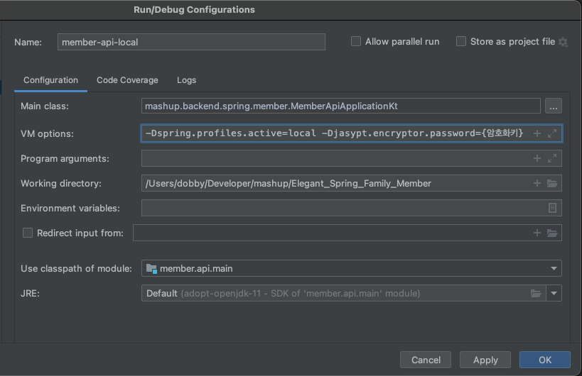

# Elegant_Spring_Family_Member
> 스프링팀 마이크로서비스 프로젝트의 회원 도메인 repository 입니다.

## Getting Started

### Prerequisites
- JDK 11
- Intellij IDEA
- 암호화키 (팀원에게 물어보기)

### Installation

#### 1. Download project 
```bash
git clone https://github.com/mash-up-kr/Elegant_Spring_Family_Member.git
```

#### 2. Run
##### Gradle wrapper
```bash
./gradlew :api:bootRun --args='--spring.profiles.active=local --jasypt.encryptor.password={암호화키}'
```
##### Intellij
